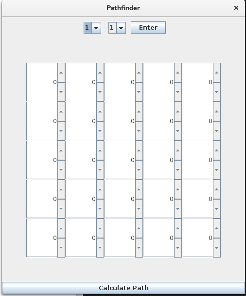
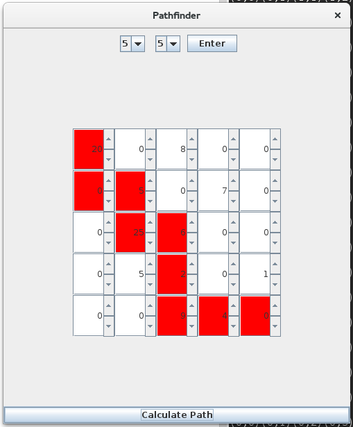

### Find most lucrative path in matrix

The user can create a rectangular N x N  matrix, with N being up to 5. Each cell in the matrix contains a number which shows how much can be gained from visiting this cell. Traversing this matrix from the upper left corner to the lower right corner, in which one can only take one step right or one step down at each turn, the program will show which path gives the greatest sum total in the end.

The user can set the values in each cell and thereby try out different path possibilities.

This is the initial state of the program when it starts. In the upper part of the window the user can select how big the matrix should be, and by pressing enter the matrix will resize.

Pressing the button in the lower part of the window will calculate the most lucrative path and show it to the user.

Code written in Java.